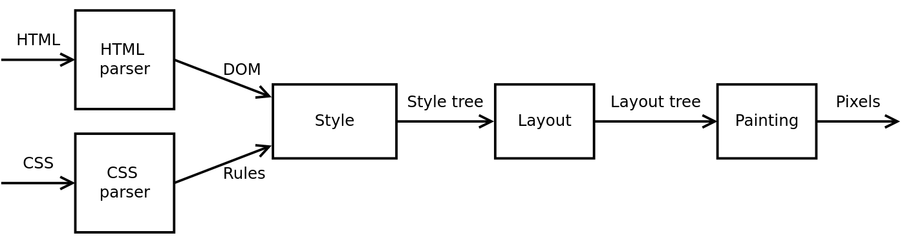

# FireKaKa

## 尝试制作一个浏览器引擎
根据[Matt Brubeck的教程](https://limpet.net/mbrubeck/2014/08/08/toy-layout-engine-1.html)
来写一个浏览器引擎，原文使用Rust语言，此项目按照原文的框架以Java实现。

## 实现功能

+ 解析HTML
+ 解析CSS
+ 构建Style tree
+ 构建Layout tree
+ 构建Pating

